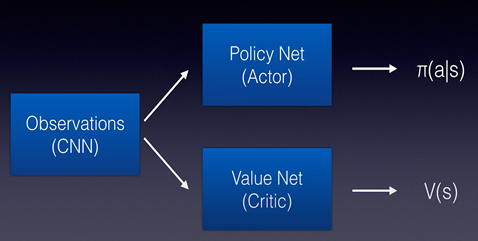
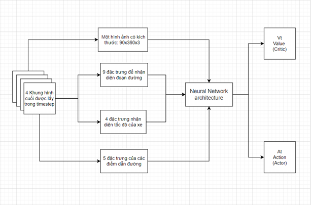

# Self_Driving_Car_Reinforcement_Learning
Áp dụng học tăng cường chương trình cho xe tự lái
## Nhóm 8:
- #### Nguyễn Đam Trường - Trưởng nhóm
- #### Nguyễn Hoàng Vũ
- #### Nguyễn Duy Hậu 
---
## Yêu cầu bắt buộc phải để sử dụng chương trình

Phần mềm:
- Python 3.7
- CARLA 0.9.9
- Libraries: install from `requirements.txt`

  ## Tải về tạo môi trường
  
Trước khi chạy chương trình bắt buộc phải có:

1. **Download CARLA 0.9.9** từ github của Carla, [here](https://github.com/carla-simulator/carla/releases/tag/0.9.9) 
   Tài liệu có thể giúp sử dụng môi trường giả lập carla [carla-quickstart](https://carla.readthedocs.io/en/latest/start_quickstart/)
   
2. **Install CARLA Python bindings** Để có thể kết nối python với Carla cần làm những yêu cầu sau:
   
    * *Windows*: `cd your-path-to-carla/CARLA_0.9.9.4/WindowsNoEditor/PythonAPI/carla/dist/`
    * *Linux*: `cd your-path-to-carla/CARLA_0.9.9.4/PythonAPI/carla/dist/`
    * Extract `carla-0.9.9-py3.7-XXX-amd64.egg` where `XXX` depends on your OS, e.g. `win` for Windows.
    * Create a `setup.py` file within the extracted folder and write the following:
      ```python
      from distutils.core import setup
      
      setup(name='carla',
            version='0.9.9',
            py_modules=['carla']) 
      ```
Before running the repository's code be sure to **start CARLA first**: 
* *Windows*: `your-path-to/CARLA_0.9.9.4/WindowsNoEditor/CarlaUE4.exe`
* *Linux*: `your-path-to/CARLA_0.9.9.4/./CarlaUE4.sh`
* [optional] Để máy có thể chạy tốt hơn và tốn ít GPU hơn thì có thể chạy câu lệnh: `-windowed -ResX=32 -ResY=32 --quality-level=Low`.
    For example `./CarlaUE4.sh --quality-level=Low`.
    
3. **Clone this repo**: `git clone https://github.com/ndamtruong2k/Self_Driving_Car_Reinforcement_Learning.git`
   * *Lưu dữ liệu code chương trình trong đường dẫn*: `your-path-to/CARLA_0.9.9.4/PythonAPI/examples`

## Ví dụ
Ví dụ học tăng cường:
```python
from core import learning

learning.stage_s1(episodes=5, timesteps=256, gamma=0.999, lambda_=0.995, save_every='end', stage_name='stage',
                  seed=42, polyak=0.999, aug_intensity=0.0, repeat_action=1, load_full=False)\
        .run2(epochs=10)
```
Quy trình đào tạo được để trong `main.py`. Hãy lưu ý rằng mỗi giai đoạn có thể mất nhiều thời gian để hoàn thành, vì vậy hãy comment những gì bạn không muốn chạy

## Cấu trúc của mạng đào tạo
Mạng PPO được áp dụng để đào tạo.



## Cấu trúc của tác nhân
Cấu trúc đầu vào và đầu ra của tác nhân.



## Kết quả

Kết quả xe chuyển làn thành công trên thị trấn 3 của Carla.


